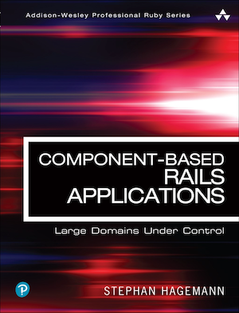

[](https://gitpitch.com/enogrob/ebook-project/master)
```
Roberto Nogueira  
BSd EE, MSd CE
Solution Integrator Experienced - Certified by Ericsson
```
# eBook Component Based Rails



**About**

Learn everything you need to about the subject of this `eBook` project.

[Homepage](http://www.informit.com/store/component-based-rails-applications-large-domains-under-9780134775241)

## Topics
```
Foreword xi
Preface xiii
Acknowledgments xxi
About the Author xxiii

Chapter 1: Introduction to Component-Based Rails Applications 1
1.1 Component-Based Rails 2
1.2 Benefits of Component-Based Applications 4
1.3 Component-Based Ruby 13
1.4 The Application Continuum 14
1.5 Related Works 15

Chapter 2: Creating a Component-Based Application 17
2.1 The Entire App Inside a Component 18
2.2 ActiveRecord and Handling Migrations within Components 27
2.3 Handling Dependencies within Components 34

Chapter 3: Tooling for Components 49
3.1 Testing a Component 50
3.2 Testing the Main Application 65
3.3 Asset Loading for Components 74
3.4 Switching Databases 82
3.5 Deploying to Platforms-as-a-Service 86
3.6 Updating Application Dependencies 90
3.7 Proposal for a Different Application Root—Showcasing the Difference of Components’ Structure 99

Chapter 4: Component Refactorings: Extracting Components Out of Components 111
4.1 Determining What to Extract: Bottom-Up 112
4.2 Refactoring: Extract Domain Gem—Predictor 120
4.3 Determining What to Extract: Top-Down 139
4.4 Refactoring: Pulling Up a UI Component—TeamsAdmin, GamesAdmin, PredictionUI, WelcomeUI 150
4.5 Refactoring: Pushing Down a Model Component—Teams, Games 168
4.6 Refactoring: Improve Naming of Component—AppComponent to WebUI 183
4.7 More Component Refactoring Patterns 189

Chapter 5: From Ball of Mud to First Components 195
5.1 Small Steps 196
5.2 One Big Step 196

Chapter 6: Component-Based Rails in Relation to Other Patterns 211
6.1 Hexagonal Architecture 212
6.2 Data-Context-Integration (DCI) 227

Chapter 7: Components in Other Languages 237
7.1 Kotlin, Java, and Gradle 238
7.2 .NET / C 241
7.3 Conclusion 243

Appendix 245
A.1 Plain versus --full versus --mountable Engines 245
A.2 How Do Engine Routes and Engine Mounting Work? 254
A.3 Additional Testing with Older Versions of Rails 261

Index 265
```
